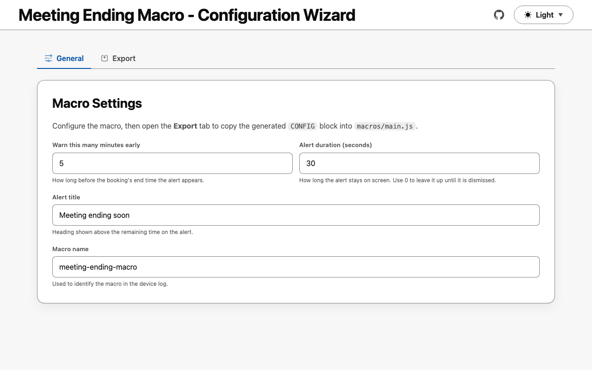

<!-- title:start -->

# Meeting Ending Macro

<!-- title:end -->

<!-- description:start -->

Alerts the room a configurable number of minutes before the current booking ends.
<!-- description:end -->

A Cisco RoomOS (Webex) macro that watches the booking currently running on the
device and puts an alert on screen a configurable number of minutes before it
ends, so the room is handed over on time.

It is built on the WXSD macro template, so it also ships a static configuration
**wizard** published to GitHub Pages for generating the macro's settings without
cloning the repo.

> The title, description, and URLs above are generated from
> `project.config.json`. Run `npm run setup` to customise them.

## How it works

The macro reads `Status Bookings Current Id`, fetches that booking with
`xCommand Bookings Get`, and sets a timer for `WARNING_MINUTES` before the
booking's `EndTime`. When the timer fires it calls
`xCommand UserInterface Message Alert Display`.

It re-reads the booking on `Bookings Updated`, so extending a meeting moves the
alert to the new end time, and it drops a pending alert when the meeting ends
early or the room becomes free. Each end time produces at most one alert. If the
macro starts when less than `WARNING_MINUTES` remain, the alert appears
immediately with the real time remaining.

## Live URLs

<!-- urls:start -->

- Wizard: https://wxsd-sales.github.io/meeting-ending-macro/wizard/

<!-- urls:end -->

## Quick start

```sh
npm install
npm run setup   # names the project and rewrites the derived values
npm test
```

`npm run setup` prompts for the project name, title, description, author, and
GitHub org/repo (auto-detected from your git remote), writes
`project.config.json`, then propagates those values into `package.json`, the
macro, and the wizard. Re-run it any time; it is idempotent.

## Project structure

```text
.
├── __tests__/        # Jest tests (macros use jest-mock-xapi)
├── .github/workflows # CI: test, deploy Pages, refresh screenshots
├── assets/           # README screenshots (generated)
├── macros/           # single-file RoomOS macros
├── scripts/          # dev automation (setup, apply-config, serve, screenshots, deploy-macro)
├── wizard/           # macro configuration app (Pages: /wizard/)
│                     #   app-config.js is generated from project.config.json
├── project.config.json         # single source of truth (see .schema.json)
└── project.config.schema.json  # JSON Schema for project.config.json
```

## Installing the macro

1. Open the device web interface: **Customization > Macro Editor**.
2. Create a new macro and paste the contents of [`macros/main.js`](macros/main.js).
3. Save and enable the macro.

### Settings

These live in the macro's `CONFIG` block:

| Constant                 | Default                 | Limits   | Description                                                        |
| ------------------------ | ----------------------- | -------- | ------------------------------------------------------------------ |
| `WARNING_MINUTES`        | `5`                     | 0 - 1440 | How many minutes before the booking ends the alert is shown        |
| `ALERT_DURATION_SECONDS` | `30`                    | 0 - 3600 | How long the alert stays on screen; `0` leaves it up until cleared |
| `ALERT_TITLE`            | `"Meeting ending soon"` | 255 char | Heading shown on the alert                                         |
| `MACRO_NAME`             | repo name               |          | Name the macro logs under                                          |

The block is generated, so change the settings in one of two places rather than
editing it by hand:

- **[Wizard](#live-urls)** - fill in the form, then **Copy config** to get a
  block to paste into the device Macro Editor, or **Download macro** for a
  ready-to-import file. Best for configuring a device without cloning the repo.
- **[`project.config.json`](project.config.json)** - edit the `macro` object and
  run `npm run apply-config` to write the values into
  [`macros/main.js`](macros/main.js). This sets the repo's defaults, which the
  wizard loads as its starting values.

Both paths share the block builder in [`wizard/snippet.js`](wizard/snippet.js),
which clamps every value to what the RoomOS xAPI accepts, so they cannot drift
apart or generate a macro a device would reject.

### Deploy to a device over xAPI

`npm run deploy:macro` uploads a macro straight to a device using
[`jsxapi`](https://github.com/cisco-ce/jsxapi). Provide credentials via
environment variables (never commit them):

```sh
DEVICE_HOST=192.0.2.10 DEVICE_USERNAME=admin DEVICE_PASSWORD=... \
  npm run deploy:macro
```

Set `MACRO_FILE` to deploy a macro other than `macros/main.js`, and
`MACRO_ACTIVATE=false` to upload without enabling it.

## Dev scripts

| Command                | Description                                                     |
| ---------------------- | --------------------------------------------------------------- |
| `npm run setup`        | Interactive rename; writes `project.config.json` and applies it |
| `npm run apply-config` | Re-apply `project.config.json` to all files                     |
| `npm run serve`        | Serve the repo locally (wizard) with Node's http server         |
| `npm run screenshots`  | Capture `assets/*-light.png` / `*-dark.png` via headless Chrome |
| `npm run deploy:macro` | Upload a macro to a device over xAPI (see below)                |
| `npm run lint`         | Lint with ESLint                                                |
| `npm run format`       | Format with Prettier (`npm run format:check` to verify)         |
| `npm test`             | Run the Jest suite                                              |

Screenshots use a headless Chrome/Chromium already installed on your machine.
Set `CHROME_BIN` to override binary detection.

<!-- Screenshots are regenerated by .github/workflows/screenshots.yml -->

<a href="https://wxsd-sales.github.io/meeting-ending-macro/wizard/">
  <picture>
    <source media="(prefers-color-scheme: dark)" srcset="assets/wizard-dark.png">
    <source media="(prefers-color-scheme: light)" srcset="assets/wizard-light.png">
    
  </picture>
</a>


## License

All contents are licensed under the MIT license. Please see [license](LICENSE) for details.

## Disclaimer

Everything included is for demo and Proof of Concept purposes only. Use of the site is solely at your own risk. This site may contain links to third party content, which we do not warrant, endorse, or assume liability for. These demos are for Cisco Webex use cases, but are not Official Cisco Webex Branded demos.

## Questions

Please contact the WXSD team at [wxsd@external.cisco.com](mailto:wxsd@external.cisco.com?subject=meeting-ending-macro) for questions. Or, if you're a Cisco internal employee, reach out to us on the Webex App via our bot (globalexpert@webex.bot). In the "Engagement Type" field, choose the "API/SDK Proof of Concept Integration Development" option to make sure you reach our team.
